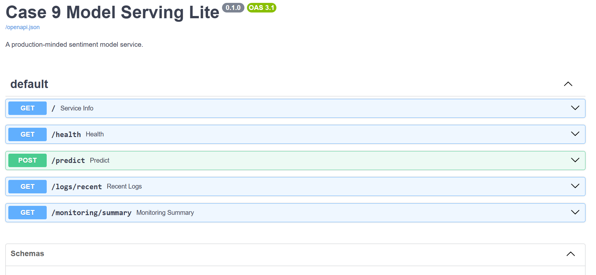

# Case 9: Model Serving Lite

**Live API docs:** https://case9-model-serving-lite.onrender.com/docs
**Base API URL:** https://case9-model-serving-lite.onrender.com
**Repo:** https://github.com/manish6263/case9-model-serving-lite
**Demo video:** coming soon

Turn a pretrained sentiment model into a small production-minded ML service with API, logging, drift checks, containerization, CI, and a demo that proves we can detect failure before users complain.

## What This Is

This project wraps a sentiment-classification model in a FastAPI service and adds the production basics around it: observability, drift checks, tests, and a retrain/evaluation gate.

The product scenario is simple: a notebook sentiment model needs to become a service that another app can call on Monday. The goal is not only a prediction endpoint, but a service that can be debugged, monitored, and safely updated.



## What Works

- `GET /health`: service readiness.
- `GET /`: browser-friendly service info and endpoint list.
- `GET /model/status`: shows whether the live service is using DistilBERT or fallback mode.
- `POST /predict`: sentiment prediction with request id, label, score, model version, and latency.
- `GET /logs/recent`: privacy-aware request/response logs.
- `GET /monitoring/summary`: drift-monitoring summary.
- Retrain/evaluation gate: trains a candidate model, evaluates held-out F1, and rejects regressions.
- Docker image and Render blueprint for deployment.

## Review The Live API

Open the interactive API docs:

```text
https://case9-model-serving-lite.onrender.com/docs
```

Health check:

```bash
curl https://case9-model-serving-lite.onrender.com/health
```

Model status:

```bash
curl https://case9-model-serving-lite.onrender.com/model/status
```

Prediction:

```bash
curl -X POST https://case9-model-serving-lite.onrender.com/predict \
  -H "Content-Type: application/json" \
  -d '{"text":"I loved this excellent product"}'
```

Recent prediction logs:

```bash
curl https://case9-model-serving-lite.onrender.com/logs/recent
```

Monitoring summary:

```bash
curl https://case9-model-serving-lite.onrender.com/monitoring/summary
```

To run the deployed drift simulation, first clone the repo because the script lives in the source repository:

```bash
git clone https://github.com/manish6263/case9-model-serving-lite.git
cd case9-model-serving-lite
python -m venv .venv
source .venv/bin/activate
pip install -r requirements.txt
export CASE9_BASE_URL=https://case9-model-serving-lite.onrender.com
python scripts/simulate_drift.py
```

## How To Run Locally

Clone and start the API:

```bash
git clone https://github.com/manish6263/case9-model-serving-lite.git
cd case9-model-serving-lite
python -m venv .venv
source .venv/bin/activate
pip install -r requirements.txt
uvicorn app.main:app --reload
```

Open `http://localhost:8000/docs`.

On Windows PowerShell, activate the environment with:

```powershell
.\.venv\Scripts\Activate.ps1
```

For Render deployment, this repo includes `render.yaml`. The live container now installs the Hugging Face dependencies and attempts to serve `distilbert-base-uncased-finetuned-sst-2-english`; if the free-tier host cannot load the model, the service falls back explicitly and the `model_version` field shows that degraded mode.

## How To Run With Docker

From the cloned repo root:

```bash
git clone https://github.com/manish6263/case9-model-serving-lite.git
cd case9-model-serving-lite
docker build -t case9-model-serving-lite .
docker run -p 8000:8000 case9-model-serving-lite
```

The default image installs Hugging Face dependencies and attempts DistilBERT. To force the deterministic fallback during local debugging or on a constrained machine:

```bash
docker run -p 8000:8000 -e CASE9_DISABLE_HF=1 case9-model-serving-lite
```

To build a lighter fallback-only image:

```bash
docker build --build-arg INSTALL_HF=false -t case9-model-serving-lite:fallback .
docker run -p 8000:8000 -e CASE9_DISABLE_HF=1 case9-model-serving-lite:fallback
```

By default, prediction logs are written to `logs/predictions.jsonl`. To override this path:

```powershell
$env:CASE9_LOG_PATH="artifacts\local-predictions.jsonl"
```

To force the deterministic fallback model during local debugging or tests:

```powershell
$env:CASE9_DISABLE_HF="1"
```

To install the optional Hugging Face dependencies locally:

```bash
pip install -r requirements-hf.txt
```

## Local API Examples

WSL / bash:

```bash
curl -X POST http://localhost:8000/predict \
  -H "Content-Type: application/json" \
  -d '{"text":"I loved this excellent product"}'
```

PowerShell:

```bash
curl -X POST http://localhost:8000/predict ^
  -H "Content-Type: application/json" ^
  -d "{\"text\":\"I loved this excellent product\"}"
```

Example response:

```json
{
  "request_id": "7dd3b8c6-76cf-47df-a9a6-4b4d33ab3e0f",
  "label": "POSITIVE",
  "score": 0.71,
  "model_version": "rule-based-fallback-v0",
  "latency_ms": 0
}
```

Recent prediction logs:

```bash
curl http://localhost:8000/logs/recent
```

Monitoring summary:

```bash
curl http://localhost:8000/monitoring/summary
```

Local drift simulation:

```bash
unset CASE9_BASE_URL
python scripts/simulate_drift.py
```

Demo request sequence:

```bash
python scripts/demo_requests.py
```

For a deployed API:

```bash
export CASE9_BASE_URL=https://case9-model-serving-lite.onrender.com
python scripts/demo_requests.py
```

Retrain and evaluation gate:

```bash
python training/train.py
python training/evaluate.py
python training/promote_if_better.py
```

To demo an auto-rejected regressed model:

```bash
python training/make_bad_candidate.py
python training/evaluate.py
python training/promote_if_better.py
```

## How To Test

```bash
git clone https://github.com/manish6263/case9-model-serving-lite.git
cd case9-model-serving-lite
python -m venv .venv
source .venv/bin/activate
pip install -r requirements.txt
pytest
```

## Demo Flow

1. Call `/predict` with a positive review and show the response.
2. Open `/logs/recent` to show the request id, score, latency, model version, text hash, and short preview.
3. Run `python scripts/simulate_drift.py` and show `/monitoring/summary` flagging drift.
4. Run the normal retrain gate and show the candidate accepted.
5. Run the bad-candidate demo and show the gate rejecting F1 regression.

## Stack

- FastAPI: typed API service with automatic docs.
- Hugging Face Transformers: pretrained DistilBERT sentiment model.
- JSONL logs: local request/response log store for demo-friendly debugging.
- Drift checks: text length, label distribution, language/script ratio, and vocabulary novelty.
- pytest: contract tests for the service.
- A deterministic fallback model keeps the service usable if model loading fails on a free-tier host.
- Docker: containerized API for Render or any container host.
- Render blueprint: `render.yaml` for free-tier API deployment.
- GitHub Actions: tests and Docker build run on push and pull request.
- Training gate: retrains a lightweight candidate model, evaluates held-out F1, and rejects metric regression.

## What's Not Done

- This is not a full model registry. The promotion gate is a transparent CI stub for the case study.
- Render free tier may still fall back if DistilBERT cannot be loaded within the available resources; that degraded mode is visible in every prediction response.

## In Production, I Would Also Add

- A real model registry with versioned artifacts and rollback.
- Alerting on latency, error rate, label shift, and drift flags.
- Shadow deployment for candidate models before promotion.
- PII redaction before any text preview is stored.
- A larger validation set with business-cost-aware thresholds.
